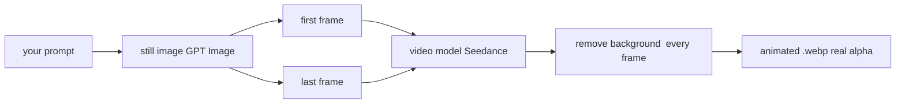

# Harvest brief, 2026-09-28

12 items shortlisted from 72 candidates (16 dropped as already seen, 1 carry a vault verdict on the vendor).

## 1. [hn] Show HN: HN.watch – Videos of all Hacker News posts
key: hn:49879401
url: https://hn.watch/
discussion: https://news.ycombinator.com/item?id=49879401
meta: {"points": 117, "comments": 71, "created": "2026-09-28T15:16:13Z"}
query: open data api

Hi HN, I’m Per, founder of Scrimba (YC S20). We’ve spent the last decade teaching people how to code with an HTML-based video format. We’ve now plugged an LLM into it, so that people can create explainer videos about anything. It’s called “Scrimba Explain”. To demo this technology for Hacker News, we built HN.watch. It’s like HN, but with explainer videos instead of articles. We create them on-the-fly the first time someone clicks on a link. While there are obvious visual drawbacks of using HTML instead of diffusion models, there are three big benefits: - Speed: Much faster to generate than pixel-based videos (just a few seconds from click to playback) - Cost: Our cost per video is ~$0.04. (Excluding image generation, which some videos utilize. Quickly blows up the cost) - Easy editing: the above benefits also make AI-assisted editing cheap & fast Our hypothesis is that if video creation goes from “dollars and minutes” to “cents and seconds”, a bunch of new use cases will be unlocked. Here are some we see already: - A video explanation of every single Pull Request (we do this internally) - Give every page in your internal/extrernal docs a video - Turn a complex article into a video in ~4 seconds (via our Chrome extension) - Course creators can quickly draft lessons before recording the real thing - People also create a lot of personal stuff stories for their kids, wedding invitations, birthdays, etc The stack is based on an open-source programming language (Imba) created by o
comment (DANmode): Thanks, I hate it. Kidding, I already sent it to a friend with ADHD who has been struggling to remain anchored to the tech world in any way besides Shorts. But, culturally, I definitely hate the trend it implies! Neat. Thank you for sharing.
comment (alentodorov): loved scrimba. thanks for building that. was anout to pushback bc of the torrent of show hn sloppy pists but this one is fun.
comment (babu_mick): yo this is wild

## 2. [github] lemomo-ai/lemo-opuscar: 39 film styles, each a reusable style prompt plus a short film made entirely in code by Claude Opus 5.5. Pick a style, bring your own story, and let your agent direct. | Opus5.5 x 39 种影片风格：风格提示词 + 纯代码样片 + 导演与技术指南
key: gh:lemomo-ai/lemo-opuscar
url: https://github.com/lemomo-ai/lemo-opuscar
meta: {"stars": 513, "created": "2026-09-26", "pushed": "2026-09-28", "language": "JavaScript", "topics": ["ai-agents", "ai-video", "animation", "canvas", "claude", "claude-code", "creative-coding", "ffmpeg"]}
query: claude-code created:>{since} stars:>20

# Lemo-Opuscar

**39 film styles, each with a short film made entirely in code.** 
**39 种影片风格，每种都配一支完全用代码做出来的短片。**

Pick a style, bring your own story, and let your coding agent direct the film. 
选一个风格，带上你自己的故事，让你的编程 agent 来当导演。

[**▶ Watch the gallery · 看图鉴**](https://lemomo-ai.github.io/lemo-opuscar/)

 

## 🎬 Feature presentation · 特别放映：OPUSCAR 98

 

   

**98 Years of Best Picture · 1927 – 2025 · 6:25** 
**98 年最佳影片 · 1927 – 2025 · 6 分 25 秒**

One Clawd walks through all 98 Best Picture winners, each one redrawn in a style that fits the film. 
Every frame, every note and every cut was written in code by Claude Opus 5.5. 
一个 Clawd 走过 98 部最佳影片，每一部都换成贴合那部电影的画风。 
每一帧画面、每一个音符、每一刀剪辑，都是 Claude Opus 5.5 写代码做出来的。

[**▶ Watch · 观看**](https://lemomo-ai.github.io/lemo-opuscar/#opuscar98) · [**Download 1080p · 下载**](https://github.com/lemomo-ai/lemo-opuscar/releases/download/films/opuscar98.mp4)

 

## 👋 About me · 关于我

I'm **Lemomo** ([@lemomo-ai](https://github.com/lemomo-ai)). More about me on my profile. 
我是 **Lemomo**，更多信息见我的 [GitHub 主页](https://github.com/lemomo-ai)。

> **Not an awesome list.** Every film here was made by me, with Claude Opus 5.5. The styles are tuned for Opus 5.5; other models may not reproduce them.
>
> **这不是一个 awesome 合集。** 这里所有的片子都是我自己用 Claude Opus 5.5 做的。风格是按 Opus 5.5 调出来的，换成其他模型不保证能做出同样的效果。

Every film was directed, drawn, scored and mixed by an AI agent writing code: canvas and WebGL pages rendered frame by frame, original music from free sample libraries, local text-to-speech. No video generation, no stock footage.

每一支片子都是 AI agent 写代码导演、作画、配乐、混音的：Canvas 和 WebGL 页面逐帧渲染，用免费采样库写原创配乐，本地 TTS 配音。不用视频生成，也不用素材库画面。

## How to use · 怎么用

Two ways in; the skill is the easiest. · 两种用法，推荐装 skill，最省事。

### Option 1: install the skill (recommended) · 方式一：装成 skill（推荐）

In your terminal · 在终端里：

```sh
claude plugin marketplace add lemomo-ai/lemo-opuscar
claude plugin install lemo-opuscar@lemolab
```

Then use it from any folder. On first use it downloads the guides, tools and style prompts (about 60 MB) to `~/lemo-opuscar`, shared by all your films. Each film's project, from source to finished video, goes in the folder you started from. For other agents, copy [`plugin/skills/lemo-opuscar/`](plugin/skills/lemo-opuscar/) into their skills folder.

之后在任何目录都能用。第一次使用时，它会把指南、工具和风格提示词（约 60 MB）下载到 `~/lemo-opuscar`，所有片子共用这一份；每支片子的工程，从源码到成片，都放在你发起时所在的文件夹里。其他 agent 可以把 [`plugin/skills/lemo-opuscar/`](plugin/skills/lemo-opuscar/) 复制到它们的 skills 目录。

### Option 2: clone the repo · 方式二：clone 仓库

```sh
git clone https://github.com/lemomo-ai/lemo-opuscar.git
cd lemo-opuscar
claude
```

Films go into `films/ /` inside the repo.

片子做到仓库里的 `films/ /`。

### Then just say what you want · 然后直接说

> Make a 45-second film in the **watercolor** style about the coffee farm my family runs. Warm female narrator.
>
> 用**油画厚涂**风格做一支 30 秒的片子，讲我家那只每天在窗台等我下班的橘猫。

Name the style in English or Chinese; the [style index](styles/README.md) lists them all. · 风格用英文名或中文名都行，全部风格见[风格索引](styles/README.md)。

It asks you once, up front: anything it can't decide about your topic, whether you have your own **voice, music or other material**, and whether you want to see a **storyboard** first. Say yes and it stops once to show you the key shots in the real style; otherwise it goes straight to the finished film.

它开工前只问你一次：主题里它定不了的事、你有没有自己的**配音、音乐或其他素材**、要不要先看**分镜故事板**。要看的话，它会停一次，给你看用真实风格画出来的关键镜头；不看就直接做完成片。

The agent reads three guides and works like a small studio · agent 会读三份指

## 3. [arxiv] Structured Reasoning Agentic Framework for Interpretable Critical View of Safety Assessment
key: arxiv:2609.31524
url: https://arxiv.org/abs/2609.31524
meta: {"published": "2026-09-25", "authors": ["Qing Xu", "Yuxiang Luo", "Zhen Chen"], "categories": ["cs.CV"]}
query: all:"language model" AND all:agent AND all:tool

Surgical scene understanding is critical for computer-assisted intervention, yet laparoscopic cholecystectomy remains challenged by the complex anatomy of the hepatocystic triangle and the risk of bile duct injury. Existing methods for Critical View of Safety (CVS) assessment typically treat it as a holistic prediction task, mapping visual features directly to criterion-level labels. This black-box paradigm lacks explicit reasoning about anatomical relationships, limiting both interpretability and compositional generalization. To address this, we propose ReasonCVS, a structured reasoning agentic framework empowered by Vision-Language Models (VLMs) that decomposes CVS assessment into explicit, fine-grained anatomical verification. Specifically, we devise an Anatomical Scene Graph Abstraction (ASGA) that organizes anatomical entities and their spatial relationships into a structured representation. To operationalize this, we introduce a Rationale-Aware Reasoning Agent, powered by a Large Language Model (LLM) fine-tuned via rationale distillation. Functioning as a strict central decision-maker, it invokes VLM-driven Sub-criterion Verifier as a specialized perceptual tool to parse the graph and independently evaluate individual sub-criteria. Through calibrated soft reasoning, this agent synthesizes the tool-gathered distributed observations, yielding a final verdict alongside a traceable clinical rationale. Extensive experiments on the Endoscapes-CVS201 benchmark demonstrate that ReasonCVS achieves superior performance (68.1\% mAP) over state-of-the-art while providing interpretable, criterion-level explanations for reliable surgical assessment.

## 4. [youtube] Agent Memory EXPLAINED - Complete Architecture
key: yt:aYfZN8t6AQs
url: https://www.youtube.com/watch?v=aYfZN8t6AQs
meta: {"channel": "Hugging Face", "rank": 1, "duration_min": 28}
query: agent memory architecture explained

# Agent Memory EXPLAINED - Complete Architecture
# Hugging Face
# https://www.youtube.com/watch?v=aYfZN8t6AQs

[00:00] Good morning everyone. If you want your agent to remember things across conversations about yourself, about itself and what it learns about the world, you're going to need an agent memory system. And today that's what we're going to be explaining. First of all, we're going to see what agent memory systems are. And then we're going to be taking a deep dive into one existing very popular memory system called Mem0. We're going to explore what stores it uses to create its full long-term memory. We're going to explore the workflows for ingestion and retrieval of the memories that it creates. And we're going to take a look at what it does when it just wants to delete one memory.
[00:38] And finally, I'm going to explain to you how you can build this yourself if you want to build it your own, and how you can run the whole thing with your own local models and some recommendations of local models that will be useful on every step of the whole thing. So without any further ado, let's get right into it. All right, so the first thing to talk about is what actually is long-form or long-term memory for agents. And something to keep in mind is that this is not the same thing as conversational memory. So remember that LLMs are stateless machines.
[01:13] In other words, when you send a prompt to your LLM, your LLM is going to process it and give you a completion. If you send another prompt to it, after that, it will not remember anything about the previous prompt or the previous completion. So if you want your agent or your assistant to be able to remember what it said before, you're going to have to send over the entire history of the conversation with your prompt so that it knows what it talked about before. And that is essentially conversational memory. This is what happens actually when you create an agent.
[01:47] So an agent scaffold or an agent harness will handle that context for you. In other words, whenever you send a message to your agent, your agent will process it with an LLM, then we'll get the response back from the LLM and will append the response, both your message and the response to the history that it keeps in its state. And then, whenever there is a new message, it will add the new message right here and send the whole thing back again to the LLM. That's the way it will remember things about its conversation. And this way, when you mention something right here, the agent will remember it right here in the conversation.
[02:26] But this is conversational memory. If you only have this, and you, for example, you start a new conversation and you send the new message, your agent will not remember anything from this other conversation because it is in another context. So, what we do when we want to create long-form memory is we create another service right here, which is going to be the long-term memory. And this one right here is going to store things from every single conversation you have. And on every turn of your agent, it is going to check its long-term memory to be able to respond with facts that it knows about you and about itself, which will be stored in the long-form memory, which will be independent from the conversational memory. Okay, and what we're going to be doing today is we're going to be taking a look at how this long-form memory works in Mem0, which is one very popular example of long-term memory impl
[transcript continues in field-notes/staging/aYfZN8t6AQs.txt]

## 5. [hn] Show HN: PaperMono, e-ink fridge magnet shopping list with mobile web page
key: hn:49875801
url: https://github.com/seamusc/papermono-shopping-list
discussion: https://news.ycombinator.com/item?id=49875801
meta: {"points": 124, "comments": 52, "created": "2026-09-28T10:14:41Z"}
query: claude code

Fridge magnet shopping list on an M5Stack PaperMono (ESP32-S3, e-ink touchscreen), synced with a phone web app over Wi-Fi. Works offline, ~2,400 lines of C++. This is a great wee device! BLE, Wi-Fi and LoRa on one board makes it flexible for way more than a shopping list, this is just what I built first. This firmware only uses Wi-Fi. Fully vibe-coded with Claude Code, I didn't hand-write this. I wanted to see how Claude would get on with building something useful for a new hardware device. As it's stuck to the fridge it's easy for the family to use, and it's already being used day to day which I'll admit is a first for a home built project like this
comment (lucasrufkahr): Hold on babe I gotta charge my fridge magnet… Jokes aside this is cool
comment (jader201): At first I thought “that’s a very specific shopping list for fridge magnets”. :)
comment (hn1rig3rak): Curious what you landed on for refresh, full flash or partial? Ticking off items one by one is exactly where partial update artifacts pile up on these panels.

## 6. [github] samyost1/3dicon: One prompt in, a looping animated 3D icon out — with real transparency. A Claude Code skill.
key: gh:samyost1/3dicon
url: https://github.com/samyost1/3dicon
meta: {"stars": 503, "created": "2026-09-23", "pushed": "2026-09-23", "language": "Python", "topics": []}
query: claude-code created:>{since} stars:>20

# /3dicon

**One prompt in, a looping animated 3D icon out** (with real transparency) an animated WebP you can drop straight into your app UI.

 
   
 

## Install

```
/plugin marketplace add samyost1/3dicon
/plugin install 3dicon
```

One OpenRouter key covers the whole pipeline — the image model and the video
model both run through it.

```bash
cd ~/.claude/skills/3dicon
pip install -r requirements.txt
cp .env.example .env
```

Put your key in `.env`:

```
OPENROUTER_API_KEY=sk-or-...
```

Get one at [openrouter.ai/keys](https://openrouter.ai/keys).

`ffmpeg` must be on PATH. The first run downloads a ~180MB matting model.

## Use

Ask for it in plain words:

> make an animated 3d fire icon using /3dicon

It generates one still, shows it, and waits for you to approve it before
spending anything on motion. Then it proposes the motion and waits again.

## How it works



The trick is in the middle: **the same still is sent as both the first and the
last frame**, so the model returns to where it began and the loop closes with
no visible seam.

The background is removed against a colour we chose ourselves, which means the
original colours can be solved for exactly rather than guessed — that is what
keeps soft edges soft instead of leaving a halo.

## Licence

MIT. Icons you generate with it are yours, with no restrictions.

## 7. [arxiv] A Safety-Bounded SDC-to-MCP Gateway for Medical AI Agents
key: arxiv:2609.31358
url: https://arxiv.org/abs/2609.31358
meta: {"published": "2026-09-25", "authors": ["Bennet Gerlach", "Stefan Fischer"], "categories": ["cs.DC", "cs.AI"]}
query: all:"language model" AND all:agent AND all:tool

The Model Context Protocol (MCP) provides a common interface through which AI applications discover and use external resources and tools. It allows language-model agents to ground their reasoning in current system state and interact with heterogeneous services. In medical environments, however, exposing device state and action affordances requires deterministic constraints on possible effects. We present an IEEE 11073 Service-Oriented Device Connectivity (SDC)-to-MCP gateway that exposes metrics, alarms, context references, and semantic metadata as read-only resources, while representing selected action affordances as policy-validated dry-run tools. The term safety-bounded denotes a narrow no-execution property: agent-facing requests dispatch no SDC device operation. A Python prototype supports simulated fault and lifecycle experiments, a software-reference protocol path spanning independent Java and Python implementations, deterministic baselines, representation ablations, and multi-model agent evaluation. The results show semantically explicit resource exposure, visible rejection of invalid or outdated state, and preservation of the no-execution boundary across resource, proposal, and authorization paths. Explicit semantic metadata improved conformity to required metric identifiers in structured alarm outputs relative to a generic representation, while retained structured-output failures reveal a distinction between plausible narrative answers and task-compliant machine-readable results.

## 8. [youtube] Open Data - How do I connect data using API
key: yt:_00jicHRIKk
url: https://www.youtube.com/watch?v=_00jicHRIKk
meta: {"channel": "ScottishPower", "rank": 1, "duration_min": 3}
query: open data uk api project

# Open Data - How do I connect data using API
# ScottishPower
# https://www.youtube.com/watch?v=_00jicHRIKk

[00:02] In this video, we're going to show you how to pull your data into Excel and PowerBI using the API feature. Now that you're logged in and have found the data set you need, connecting it to your tools is quick and easy. Here's how. First, generate an API key. Go to account, portal settings, API keys. Generate a new API key. Select your permissions. Click generate API key. You have now
[00:37] generated your API key and we'll come back to that shortly. Next, return to your data set to dynamically connect the data. You'll need to click export data and copy the CSV link. By default, this gives you the full data set. If you only want specific data, head to explore data first. Apply your filters and then come back to export data and
[01:10] copy the filtered CSV link for your selected data. Bring your data straight into Excel. Go to data, get data from web. Paste the data set URL in the advanced tab. Add in your header parameters. Authorization. This needs to be exact spelling. Copy the API key you created earlier. In the command type API key, add a space and then paste your key. Click okay. Then
[01:44] use Power Query to transform and load your data, which is perfect for quick analysis. PowerBI integration is ideal for dashboards and visual insights. To pull the data directly into PowerBI, select get data web advanced. Paste the data set URL. Add your header parameters authorization keeping exact spelling API key followed by a space and then
[02:18] your key. You can then use Power Query to refine your data and start building interactive reports. If you would like a faster, smarter way to get data, then try API query, our brand new feature on the portal. This is designed to make integration more efficient as it allows you to filter and refine your data set before exporting. Go to your data set. Click use API console. Explore the data structure and table headers. The data identifiers will
[02:51] be required to build your API query. Enter your criteria and hit send. Here you can view your filtered output. Copy the new URL and use it in Excel, PowerBI or Python. With the API query, you get exactly what you need. making things simple and efficient. That's it. You're ready to explore our open data in Excel and PowerBI. Visit the portal for more tips, including our full how-to guides and API documentation.

## 9. [hn] Launch HN: Vespper (YC F24) – SOTA Docx MCP
key: hn:49881505
url: https://www.vespper.com/blog/launching-vespper-docx-mcp
discussion: https://news.ycombinator.com/item?id=49881505
meta: {"points": 29, "comments": 8, "created": "2026-09-28T17:34:36Z"}
query: agent skills

Hey HN! We're Dudu and Topaz from Vespper ( https://vespper.com ). Vespper is an MCP that lets AI agents efficiently edit Word documents, powered by our fine-tuned model. It's currently 3× faster, 2× cheaper and more accurate than the closest alternative. Check out an overview of how the product works here: https://youtu.be/odKxsgPjzzw We came to work on this problem after spending a year building an AI document editor for pharma companies. Before that, Topaz(myself) was a senior SWE at Snyk, working on distributed systems, and Dudu was a deep learning engineer at Viz.ai, building computer vision models for stroke detection. Our editor helped pharma companies generate regulatory documents (e.g. CSRs) to speed up their submissions. Initially, the output was Markdown, displayed in a WYSIWYG editor. However, users preferred working with their own Word templates. That's when the problems began. AI agents aren't great at editing Word documents. A Word document is a zip file of verbose XML files following the OOXML spec. Even "small" changes require backflips, for example: adding a numbered list requires creating an entry in numbering.xml with a fresh ID and linking it back in document.xml, bolding a sentence requires splitting it into 3+ run elements. The list goes on. This makes editing the zip directly (unzip + grep + sed) a bad idea for agents because they burn a lot of time + tokens on these mechanics. In practice, today's tooling falls into roughly three categories. You can l
comment (david1542): Btw we open sourced a Word add-in project that shows how to build a Word add-in with Vespper MCP: https://github.com/vespperhq/examples/tree/main/word-add-in
comment (topaztee): sign up for free to try: https://app.vespper.com/
comment (c0mbonat0r): we need to fill templates that customers give us, we’ve already built an agent harness with python-docx. It’s not perfect but it ~works. Does Vespper completely replace that or can our harness be used alongside your MCP?

## 10. [github] jkawamoto/mcp-youtube-transcript: MCP server retrieving transcripts of YouTube videos
key: gh:jkawamoto/mcp-youtube-transcript
url: https://github.com/jkawamoto/mcp-youtube-transcript
meta: {"stars": 484, "created": "2025-02-08", "pushed": "2026-09-24", "language": "Python", "topics": ["mcp-server", "python", "youtube"]}
query: youtube transcript pushed:>{since} stars:>20

# YouTube Transcript MCP Server

[](https://github.com/astral-sh/uv)
[](https://github.com/jkawamoto/mcp-youtube-transcript/actions/workflows/python-app.yaml)
[](https://github.com/pre-commit/pre-commit)
[](https://github.com/jkawamoto/mcp-youtube-transcript/blob/main/LICENSE)
[](https://hub.docker.com/mcp/server/youtube_transcript)

This MCP server retrieves transcripts for given YouTube video URLs.

## Tools
This MCP server provides the following tools:

### `get_transcript`
Fetches the transcript of a specified YouTube video.

#### Parameters
- **url** *(string)*: The full URL of the YouTube video. This field is required.
- **lang** *(string, optional)*: The desired language for the transcript. Defaults to `en` if not specified.
- **next_cursor** *(string, optional)*: Cursor to retrieve the next page of the transcript.

### `get_timed_transcript`
Fetches the transcript of a specified YouTube video with timestamps.

#### Parameters
- **url** *(string)*: The full URL of the YouTube video. This field is required.
- **lang** *(string, optional)*: The desired language for the transcript. Defaults to `en` if not specified.
- **next_cursor** *(string, optional)*: Cursor to retrieve the next page of the transcript.

### `get_video_info`
Fetches the metadata of a specified YouTube video.

#### Parameters
- **url** *(string)*: The full URL of the YouTube video. This field is required.

### `get_available_languages`
Retrieves the available languages for the video.

#### Parameters
- **url** *(string)*: The full URL of the YouTube video. This field is required.

## Installation
> [!NOTE]
> You'll need [`uv`](https://docs.astral.sh/uv) installed on your system to use `uvx` command.

### For [goose](https://block.github.io/goose/)
Please refer to this tutorial for detailed installation instructions:
[YouTube Transcript Extension](https://block.github.io/goose/docs/mcp/youtube-transcript-mcp).

### For [Claude](https://claude.com/download)

Download the latest MCP bundle `mcp-youtube-transcript.mcpb` from
the [Releases](https://github.com/jkawamoto/mcp-youtube-transcript/releases) page,
then open the downloaded `.mcpb `file or drag it into the Claude Desktop's Settings window.

 
 Manually configuration 

You can also manually configure this server for Claude Desktop.
Edit the `claude_desktop_config.json` file by adding the following entry under
`mcpServers`:

```json
{
  "mcpServers": {
    "youtube-transcript": {
      "command": "uvx",
      "args": [
        "--from",
        "git+https://github.com/jkawamoto/mcp-youtube-transcript",
        "mcp-youtube-transcript"
      ]
    }
  }
}
```
After editing, restart the application.

 

For more information,
see: [Connect to local MCP servers - Model Context Protocol.](https://modelcontextprotocol.io/docs/develop/connect-local-servers).

### For [LM Studio](https://lmstudio.ai/)
To configure this server for LM Studio, click the button below.

[](https://lmstudio.ai/install-mcp?name=youtube-transcript&config=eyJjb21tYW5kIjoidXZ4IiwiYXJncyI6WyItLWZyb20iLCJnaXQraHR0cHM6Ly9naXRodWIuY29tL2prYXdhbW90by9tY3AteW91dHViZS10cmFuc2NyaXB0IiwibWNwLXlvdXR1YmUtdHJhbnNjcmlwdCJdfQ%3D%3D)

### Using Docker

A Docker image for this server is available on [Docker Hub](https://hub.docker.com/mcp/server/youtube_transcript/).
Please refer to the Docker Hub page for detailed usage instructions and documentation.

## Response Pagination
When retrieving transcripts for longer videos, the content may exceed the token size lim

## 11. [youtube] Car Depreciation Explained and How to Beat it
key: yt:XWz0HiXVrIY
url: https://www.youtube.com/watch?v=XWz0HiXVrIY
meta: {"channel": "Carmoola", "rank": 1, "duration_min": 4}
query: car depreciation data analysis

# Car Depreciation Explained and How to Beat it
# Carmoola
# https://www.youtube.com/watch?v=XWz0HiXVrIY

[00:00] Buy a brand new car and you might as well do this. But what if I told you there's a smarter way to save your hard-earned cash? We all know that cars lose value over time, but how much, how fast, and why? That's the real kicker. So, let's break down card appreciation plain and simple. In this video, we'll show you how to avoid the most expensive car buying mistake most people don't even realize
[00:33] they're making and which cars here in the UK are almost depreciation proof. Depreciation is just a fancy word for value loss. It happens to both new and used cars, but the value drop is usually bigger for a brand new vehicle. As soon as you drive a new car off the fourcourt, bam, like that, it's no longer new. And you can lose up to 15% of its value and up to 35% in the first year alone. So, let's break it down in real numbers. Let's say you buy a new
[01:06] car for £25,000. At the end of the first year, it's worth around about £17,500. So, that's a 7 12 grand drop just for owning it. After 3 years, it's worth around about 13 grand. And at the end of year five, you'll be lucky if you can get £10,000 for it. So that's 15 grand gone and not on fuel, insurance, or repairs. That's just depreciation. It's the biggest invisible cost of car ownership and the one that most people forget about. It's not just time ticking away.
[01:44] Depreciation is also driven by mileage. >> [music] >> Every mile you drive chips away at your car's value. Condition. Scratches, scuffs, strange smells. Buyers notice these things. Fuel economy. In this day and age, petrol guzzlers age [music] like milk. Brand reputation. Did you know that cars from Toyota and Honda can depreciate slower [music] than some luxury brands? Tech and trends. Remember when CD players were a thing? Also,
[02:19] where you live can [music] impact depreciation. Coastal areas or park your car outside. More rust equals more value loss. Give this video a thumbs up if you're getting the info you need. Fun fact, depreciation doesn't [music] always go to plan, though. Back in 2020, due to the pandemic, used cars actually went up in value due to shortages and production delays. Your car's trade in value is often established via current auction prices, but generally speaking,
[02:54] new cars tend to lose value the quickest in the first 3 years, and then things slow down. Popular models and those aligned with current technology trends [music] tend to hold their value better. the Hyundai i10 which holds [music] its competitive value with it being a popular car for firsttime drivers due to its cute design and low engine power and also the Toyota Yaris Cross which offers a decent amount of space and functionality and of course that allimportant elevated ride height and finally the Porsche Macan. Make sure to
[03:28] subscribe if you want more car recommendations. All right, here's the cheat sheet to beating card appreciation. Buy 3 to 5 years old. Let someone else take the initial big hit. Keep it in good nick, clean, full service history and accidentfree. Buy a reliable, popular model. And if you can, in a standout color. Believe it or not, according to our depreciation index, cars in yellow, purple, or orange tend to hold their value longest. And if you're financing,
[04:02] make sure you understand your car's future value, especially on PCP deals. You don't want to end up owning more than
[transcript continues in field-notes/staging/XWz0HiXVrIY.txt]

## 12. [hn] Show HN: OpenAPPA – open-source deterministic guardrails that don't break agents
key: hn:49877515
url: https://www.openappa.com/
discussion: https://news.ycombinator.com/item?id=49877515
meta: {"points": 23, "comments": 11, "created": "2026-09-28T13:20:44Z"}
query: claude code

Hi Hacker News! Matvey, one of the authors, is here. While building enterprise agents, we ran into a problem: the more tools you connect to the AI, the higher the chance it will run out of control and leak sensitive data. Guardrails, in theory, should prevent this, but the situation is worrying: - Non-deterministic guardrails (LLM as a judge, auto modes, etc.) are vulnerable to prompt injections, or they lack knowledge of the data, making them inefficient (~10% data leaks on our benchmarks). - Existing deterministic guardrails (Cedar, OPA, FIDES, Dogwood) require massive case-specific IF-ELSE-like policies and break agents (~59% utility loss on our benchmarks). We did something differently. We’ve taken the best of existing deterministic guardrails and built a policy language that is data-specific, not use-case specific. It lets you scale agents without updating a policy. On top of that, we’ve added multiple tricks (like a remedy plan or a DualLLM pattern) to help agents operate within those restrictions, raising utility from ~40% to ~90% and making it the first deterministic guardrail that doesn't break agents. Finally, we’ve designed it to be pluggable into any agent loop with pre- and post-tool-call hooks. We invite you to check out our benchmarks: https://www.openappa.com/evaluation Play with it in Claude Code: https://www.openappa.com/claude-code Try plugging it into your agent: https://www.openappa.com/add-to-agent Or check the academic paper: https://arxiv.org/abs/2607.
comment (dvorkanton): Finally some determinism in our high-temperature sampling world!
comment (joeyorlando): aussi, si vous êtes à Montréal et vous aimerez apprendrez plus sur OpenAPPA, viens à l'evenement CNCF demain soir, le 29 - je ferai un p'tit discours sur l'integration kagent d'OpenAPPA. https://www.meetup.com/kubernetes-montreal/events/316689391/
comment (arseny_info): I still remember the times when ai/ml security was about perturbing pixel gradients to misclassify a panda
